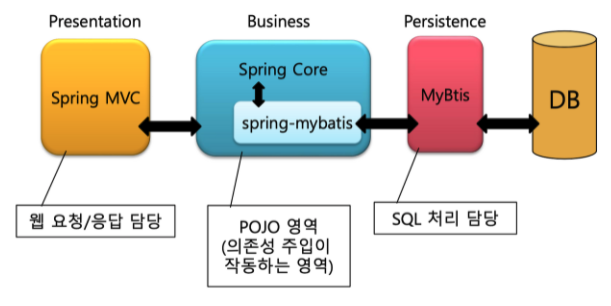

## 2021.08.11

---

### 1. Spring Boot

- spring framework를 annotation 등을 통해 빠르게 개발할 수 있도록 함

- 핵심 기능

  - SpringApplication, 외부설정, 프로파일, 로깅, 테스트 등

- 이외의 부가 기능

  - 웹 MVC, 데이터, 시큐리티, REST API 클라이언트 등

- **Property configuration** (옵션 추가/작성 - 메일서버, DB종류, 로그사용여부 등)

  - 우선순위 : Command line > Java System > OS 환경 변수  > @PropertySource, @Configuration  				> 외부 properties >  내부 properties > 기본속성 (SpringApplication.setDefaultProperties)
  - 값 주입 방식
    - `@Value` (타입 안정성 x)
      - placeholder : `${ }`
      - SpEL : `#{ }`
    - `@ConfigurationProperties`
      - 클래스 정의 필요. Setter 정의 필요
      - `@Value`와 달리 CamelCase로 작성한 변수 찾아서 주입해줌
    - `@ConstructorBinding`
      - 위의 두가지 방식이 불변성을 보장하지 못한 것을 보완. final 키워드 사용
      - `@Configuration` 을 이용해 직접 Spring Bean으로 만들 수 없으므로 `@EnableConfigurationProperties` 활용

- **Bean**

  - IoC 컨테이너에 의해 관리되며, Spring Application의 뼈대를 이루는 객체

  - Bean으로 등록하면 개발자 대신 Spring Container가 객체를 관리(제어) 해줌

    - 실제로 객체를 생성하지 않고 미리 생성된 Bean을 가져다 쓰는 방식으로 의존성 관리

    - 객체를 효율적으로 관리할 수 있음(싱글톤 -> 항상 같은 객체를 사용하여 메모리 절약 + 런타임에서의 성능 최적화)

  - xml 또는 annotation으로 등록 가능

    - Component Scan : `@Component` 와 `@Bean` 어노테이션을 Bean으로 자동 등록 (`@SpringBootApplication`에 `@ComponentScan`이 포함 됨) -> 더 먼저 실행
    - Auto Configuration : `@SpringBootApplication` 어노테이션에 포함된 `@EnableAutoConfiguration`
    - `@Component`, `@Repository`, `@Service`, `@Controller`, `@Autowired`, `@Resource`, `@Value`, `@Configuration` 등

### 2. Spring MVC

- Spring 의 서브 프로젝트로, Servlet / JSP 보다 빠른 개발 가능
- 구성 및 흐름
  - DispatcherServlet
    - 흐름의 중심이 되는 객체
    - 클라이언트의 요청을 받고, controller가 반환한 결과를 View에 전달하여 응답 생성
  - HandlerMapping / HandlerAdapter
    - 클라이언트의 브라우저에서 요청한 URL에 따라 적절한 controller를 결정 후 요청
  - Controller
    - 받은 요청을 처리하고 그 결과인 ModelAndView를 DispatcherServlet 에게 전달
  - ViewResolver
    - controller의 실행결과를 클라이언트에게 보여주기 위해 적절한 View로 생성 후 반환
- 개발 순서
  - DispatcherServlet을 설정
  - Controller 작성(구현)
  - ViewResolver 설정
  - Jsp 등을 이용해 View 영역 코드 작성
- 3 Tier architecture
  - Presentation Layer : 화면계층 (HTML, Servlet/JSP, **Spring MVC** 등)
  - Business Layer : 비지니스 로직
  - Persistence Layer : 데이터 보관(DB, MyBatis 등)

### 3. gradle 구성

- Ant, Maven 과 같은 기존의 빌드툴과 비교해 xml의 구조적 틀을 벗어나 간결한 정의 가능
- 모든 Gradle script 는 하나 이상의 project 로 구성되며, 모든 project 는 하나 이상의 task 로 구성
  - project : 소스를 jarfㅗ 모으거나, 자바 프로젝트를 컴파일하거나, 테스트 실행, App 배포 등의 업무로 구성
  - task : 작업의 최소단위 (task 간의 의존관계 설정과 함께 흐름에 따른 구성 가능)
- Build 설정 파일
  - settings.gradle : 프로젝트 구성 설정 ( 싱글 프로젝트의 경우 생략 가능 )
  - Build.gradle : 빌드에 대한 모든 기능 정의

- Build 3단계

  1. 초기화 : 빌드 대상 프로젝트를 결정하고 각각에 대한 project 객체 생성

  2. 구성 : 빌드 대상이 되는 모든 프로젝트의 빌드 스크립트 실행
  3. 실행 : 구성 단계에서 생성하고 설정된 프로젝트의 태스크 중 실행 대상 결정. 